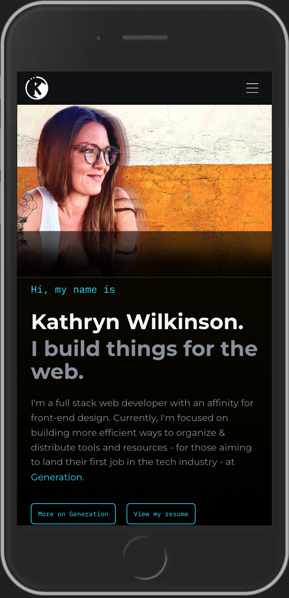
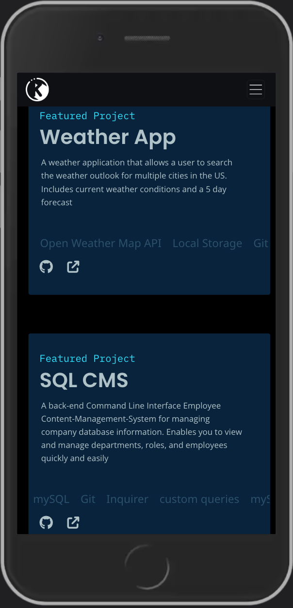

# Web Developer Portfolio

Web developer portfolio. Check it out! 

## Table of Contents

- [Description](#web-developer-portfolio)
- [Contributing](#contributing)
- [Technologies](#tech)
- [Visuals](#visuals)
- [Contact Me](#questions)
- [License](#license)

## Contributing

Sole contributor: k.wilkinson

### Tech

- HTML & CSS
- Foundation UI (phasing out)
- jQuery Endless Scroll Plugin
- Custom Images + Icons
- VS Code
- iTerm 2
- Git + GitHub

## Visuals

- [Deployed on GitHub pages](https://kathrynwilkinson.github.io/Portfolio/)
- [Source Code](https://github.com/kathrynwilkinson/Portfolio.git)

## Questions?

Please feel free to contact me with any questions via email or LinkedIn.

- Github: [kathrynwilkinson](https://github.com/kathrynwilkinson)
- LinkedIn: [kwilkinsonxx](https://www.linkedin.com/in/kwilkinsonxx/)
- Email: [kathrynxwilk@gmail.com](kathrynxwilk@gmail.com)

## License

This project is licensed under the MIT License.
For more information, please visit: [MIT Explained](https://choosealicense.com/licenses/mit/)

&copy; 2021 k.wilkinson
